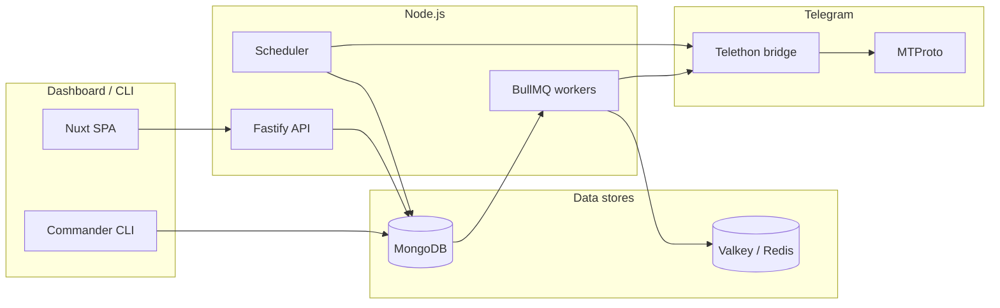

# tg-send-mult

**Multi-account Telegram outreach platform** — manage sender sessions, audience lists, message templates, and campaigns from a web dashboard or CLI. Built for teams that need controlled, observable bulk messaging over MTProto (user accounts), not bots.

> **Local-first.** You run MongoDB, Redis, and this app on your own machine or servers. There is no hosted SaaS. Optional **Docker Compose** stack: [docs/DOCKER.md](docs/DOCKER.md) (dashboard on **http://127.0.0.1:3048**).

---

## What it does

| Capability | Summary |
|------------|---------|
| **Multi-account sending** | Many Telegram user sessions send in parallel, each with its own BullMQ queue and rate limits. |
| **Campaign engine** | Pick senders, audience (tags or explicit contacts), and a template; start/pause/resume from the dashboard or CLI. |
| **Sticky sender binding** | Once a contact receives mail from sender A, later campaigns reuse A for that contact (when A is in the pool). |
| **Cross-campaign dedup** | The same text is never sent twice to the same recipient, even across different campaigns. |
| **Per-account proxies** | MTProxy (incl. FakeTLS), SOCKS5, or direct; one proxy per sender, with optional auto-assign by phone country. |
| **Anti-limit pacing** | Daily caps, hourly rates, sending windows, lognormal jitter, warm-up status, health scores, flood-wait backoff. |
| **Delivery verification** | Mark accounts as `test_recipient`, sync their inbox, and confirm campaign messages actually arrived. |
| **Web dashboard** | Senders, proxies, contacts, templates, campaigns, **dialogs** — plus BullMQ queue monitor. |
| **Dialog simulation** | Ready-made human-style chat scripts (presets), sessions between two senders, manual or auto turns. |
| **CLI + REST API** | Same operations available headless for automation. |

## What it is not

- **Not a Telegram Bot API product.** It uses **user accounts** (MTProto via Telethon). You need real phone numbers and sessions.
- **Not a guarantee against bans.** Telegram limits bulk outreach aggressively. This tool throttles and handles errors — it does not bypass Telegram policy.
- **Not plug-and-play.** You install Node 20, Python 3, MongoDB (7+; Artix often uses 8.x), and **Valkey** or Redis yourself — or use [Docker Compose](docs/DOCKER.md).

For behavioral guidance and limit context, see [docs/TELEGRAM_SPAM_AND_LIMITS.md](docs/TELEGRAM_SPAM_AND_LIMITS.md).

---

## How it fits together



**Three processes must run** for campaigns to deliver:

1. **API** (`dev:api` / `start:api`) — dashboard, REST, Bull Board.
2. **Worker** (`dev:worker` / `start:worker`) — consumes send jobs per account.
3. **Scheduler** (`dev:scheduler` / `start:scheduler`) — daily counter reset, warm-up, inbox sync.

---

## Quick start

1. **Install dependencies** — follow the setup guide for your OS:
   - [Ubuntu / Debian](docs/SETUP_UBUNTU.md)
   - [Windows 10 / 11](docs/SETUP_WINDOWS.md)
   - [Artix Linux (OpenRC)](docs/SETUP_ARTIX.md)

2. **Configure and verify:**
   ```bash
   cp .env.example .env
   # Set SESSION_KEY (64-char hex), MongoDB/Redis URIs, dashboard password
   npm run setup          # validates .env, Mongo, Redis, Telethon
   npm run build:all
   ```

3. **Start the stack** (three terminals):
   ```bash
   npm run dev:api
   npm run dev:worker
   npm run dev:scheduler
   ```

4. **Open the dashboard:** [http://localhost:3000](http://localhost:3000) (Basic Auth from `.env`).

   **Or Docker Compose** (API + worker + scheduler + Mongo + Valkey): see [docs/DOCKER.md](docs/DOCKER.md) → `npm run docker:up` → [http://127.0.0.1:3048](http://127.0.0.1:3048).

5. **Add a sender** (CLI example — MTProxy required for Telegram actions):
   ```bash
   npm run cli -- auth login --proxy-id <proxyId>
   npm run cli -- send-test --account <id> --to me --text "hello"
   ```

6. **Read the user guide** for the full workflow: [docs/USER_GUIDE.md](docs/USER_GUIDE.md).

---

## Documentation

| Document | Audience |
|----------|----------|
| **[User guide](docs/USER_GUIDE.md)** | Operators — dashboard, campaigns, verification, troubleshooting |
| [Setup: Ubuntu / Debian](docs/SETUP_UBUNTU.md) | First install on Linux |
| [Setup: Windows](docs/SETUP_WINDOWS.md) | First install on Windows |
| [Setup: Artix Linux](docs/SETUP_ARTIX.md) | First install on Artix (OpenRC) |
| [Docker Compose (local)](docs/DOCKER.md) | All-in-one stack on port **3048** |
| [Telegram limits & safety](docs/TELEGRAM_SPAM_AND_LIMITS.md) | Why throttling exists; error semantics |

---

## Stack

- **Node.js 20 + TypeScript 5** — API, worker, scheduler, CLI
- **Telethon (Python)** — MTProto bridge at `python/tg_worker/run.py` (stdio JSON from Node)
- **MongoDB 7+ + Mongoose** — accounts, contacts, campaigns, messages, proxies, delivery events
- **Valkey / Redis + BullMQ** — per-account send queues + [Bull Board](http://localhost:3000/admin/queues)
- **Fastify v5** — REST API (Basic Auth) + static SPA
- **Nuxt 3 + Vuetify 3** — dashboard SPA (built into `src/apps/api/public`)
- **Vitest** — 170 unit tests; no live Telegram connection required

---

## Key concepts (short)

### Senders vs recipients

- **Sending accounts** — Telegram sessions that *deliver* messages (Senders page / CLI `auth login`).
- **Contacts (recipients)** — People you message: phones or @usernames imported via CSV (Contacts page). Campaigns never type @handles on the Senders page.

### Account roles

| Role | Behavior |
|------|----------|
| `sender` (default) | Included in campaign sender pools; can dispatch messages. |
| `test_recipient` | Never sends; inbox is synced to verify that campaigns arrived. |

### Account statuses

`new` → `warming` → `active` (normal path). **Warm-up:** 3 calendar days, **1 dialog script per day** (then auto-promote to `active`); campaign sends capped at **1 new contact/day** while `warming`. Also: `paused`, `quarantined`, `banned`. Only `active` and `warming` senders with a saved session, healthy score (≥ 0.5), and no active flood-wait/quarantine are eligible for campaigns.

### Sticky sender + even distribution

On first delivery, a contact is linked to one sender. Later campaigns reuse that sender when they are in the pool. New contacts are spread evenly across eligible senders in the pool.

### Templates

Placeholders: `{firstName}`, `{lastName}`, `{name}`, `{phone}`, `{username}`, plus any `contact.extras` field. Spintax: `{A|B|C}` or `{Joe,Moe}`. Optional homoglyph mixing (Latin/Cyrillic lookalikes) per campaign.

---

## End-to-end verification workflow

Prove that messages reach real inboxes:

1. Log in **senders** and **test recipients** (same `auth` flows; set role on test accounts).
2. Import test recipient phones as **contacts** (tag them, e.g. `qa`).
3. Create a **template** and **campaign** targeting that tag; **start** it with all three processes running.
4. Run **verify** when finished:
   ```bash
   npm run cli -- campaign verify <campaignId>
   ```
   Or use **Verify** on the campaign row in the dashboard.

Expected output shape:
```json
{
  "campaignId": "...",
  "totalSent": 2,
  "testRecipients": 2,
  "observable": 2,
  "verified": 2,
  "missing": 0
}
```

Details: [User guide — Verify deliveries](docs/USER_GUIDE.md#verify-deliveries).

---

## CLI (summary)

```text
tg auth login [-p +phone] [--proxy-id <id>] [--api-id <n>] [--api-hash <h>]
tg auth import-session | import-tdata | import-json | import-mtp
tg proxies add-mtproto | list
tg accounts list | pause | resume | set-role | verify-login | sync-inbox
tg send-test --account <ref> --to <peer> --text "..."
tg contacts import <file.csv|json>
tg templates create --name <n> --body "..."
tg campaign create | start | pause | resume | stats | verify
tg dialog scripts presets list | dialog sessions create --preset <slug> ...
```

Full reference: [User guide — CLI reference](docs/USER_GUIDE.md#cli-reference).

---

## REST API (summary)

- Mount: `/api` (Basic Auth, same credentials as dashboard)
- Health: `GET /health` (no auth)
- Metrics: `GET /metrics` (Prometheus-style counters)
- Bull Board: `/admin/queues`

Notable routes: accounts, proxies, contacts, templates, campaigns, **dialog-scripts / presets / sessions**, messages, inbound-replies.

Full list: [User guide — REST API](docs/USER_GUIDE.md#rest-api).

---

## Development

```bash
npm install && cd web && npm install && cd ..
npm run setup:python
cp .env.example .env
npm run setup
npm run build:all
npm test
npm run lint
npm run typecheck
```

**Helper scripts:**

| Command | Purpose |
|---------|---------|
| `npm run mongod:local` | Start local MongoDB (Artix-style config) |
| `npm run docker:doctor` | Check Docker socket, buildx, permissions |
| `npm run docker:up` | Full stack via Compose → [DOCKER.md](docs/DOCKER.md) |

**Production notes:** set `NODE_ENV=production`, change `API_BASIC_USER` / `API_BASIC_PASSWORD` (≥ 12 chars), and configure `CORS_ALLOWED_ORIGINS` if the dashboard is on another origin. The app refuses to start in production with default credentials.

**Database migrations** (run once when upgrading):
```bash
npm run migrate:message-dedup
npm run migrate:contact-phone-index
npm run migrate:campaign-contact-dedup
```

---

## Project layout

```
src/apps/       api, worker, scheduler, cli
src/modules/    auth, messaging, multi, proxy, antilimit, template, contacts, dedup
src/telegram/   Telethon bridge, errors, session crypto
src/queue/      BullMQ queues + send processor
src/db/models/  Mongoose schemas
python/         Telethon worker (run.py)
web/            Nuxt dashboard source
docs/           Setup guides, user guide, limits notes
tests/          Vitest (no live Telegram)
```

---

## Risks and compliance

Telegram user-account bulk messaging can trigger `FLOOD_WAIT`, `PEER_FLOOD`, session bans, and account freezes. This project:

- Throttles per account (queues, caps, windows, jitter)
- Deduplicates recipient + text
- Maps errors to backoff, quarantine, or skip
- Isolates accounts (one flood wait does not block others)

**You** are responsible for consent, opt-out, applicable law, and [Telegram's Terms of Service](https://telegram.org/tos). Use test recipients and low volume before scaling.

See [docs/TELEGRAM_SPAM_AND_LIMITS.md](docs/TELEGRAM_SPAM_AND_LIMITS.md).
